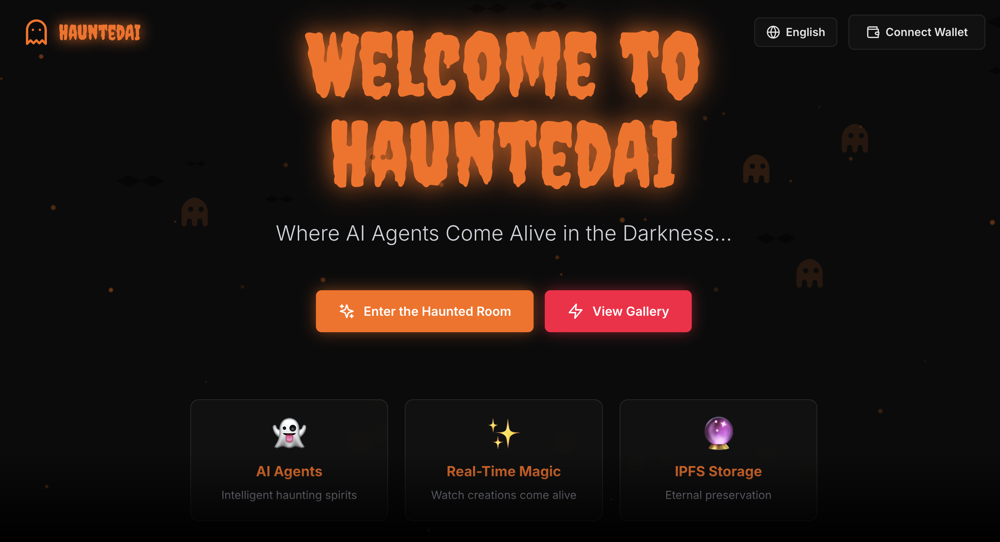
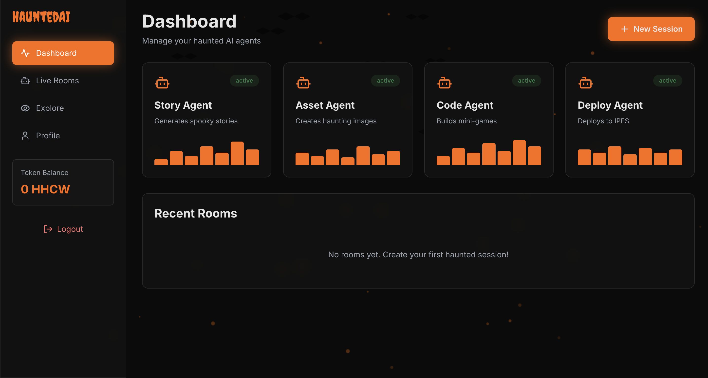
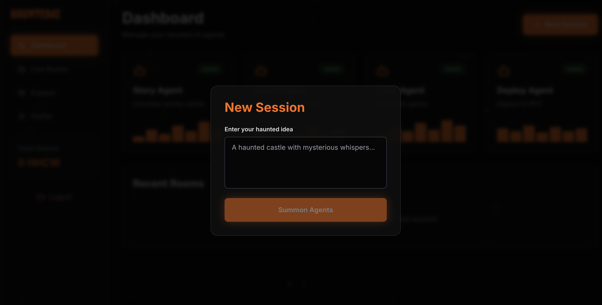

# HauntedAI Platform

> Enterprise-grade Multi-Agent AI System with Decentralized Storage and Blockchain Integration

[](https://opensource.org/licenses/MIT)
[](https://nodejs.org/)
[](https://www.typescriptlang.org/)
[](https://www.docker.com/)
[](https://testnet.bscscan.com/)
[](./coverage)
[](./.kiro/specs)

---

## Table of Contents

- [Overview](#overview)
- [System Architecture](#system-architecture)
- [Screenshots](#screenshots)
- [Core Features](#core-features)
- [Technology Stack](#technology-stack)
- [Kiro Integration](#kiro-integration)
- [Getting Started](#getting-started)
- [Use Cases](#use-cases)
- [Testing Strategy](#testing-strategy)
- [Deployment](#deployment)
- [API Documentation](#api-documentation)
- [Contributing](#contributing)
- [License](#license)

---

## Overview

HauntedAI is a production-ready, multi-agent AI orchestration platform that demonstrates advanced software engineering practices including:

- **Autonomous Agent Coordination**: Four specialized AI agents (Story, Asset, Code, Deploy) working in a coordinated workflow
- **Decentralized Storage**: IPFS/Storacha integration for permanent, censorship-resistant content storage
- **Blockchain Integration**: ERC20 token rewards and ERC721 NFT badges on BNB testnet
- **Real-time Communication**: Server-Sent Events (SSE) for live agent operation streaming
- **Property-Based Testing**: 152 correctness properties with 15,200+ test iterations
- **Spec-Driven Development**: Formal requirements and design specifications


### What Makes This Different

Unlike typical AI content generators, HauntedAI implements:

1. **Formal Verification**: Every feature backed by mathematical correctness properties
2. **Zero-Defect Development**: Automated hooks prevent broken code from being committed
3. **Decentralized-First**: All generated content stored permanently on IPFS with CIDs
4. **Production-Grade**: Full observability with Prometheus/Grafana, error recovery, and horizontal scaling

---

## System Architecture

### High-Level Architecture

```
┌──────────────────────────────────────────────────────────────────┐
│                     Client Layer (Browser)                        │
│  ┌────────────┐  ┌────────────┐  ┌────────────┐                │
│  │  Next.js   │  │  Three.js  │  │   Web3     │                │
│  │  Frontend  │  │  Canvas    │  │  Wallet    │                │
│  └─────┬──────┘  └─────┬──────┘  └─────┬──────┘                │
└────────┼───────────────┼───────────────┼────────────────────────┘
         │               │               │
         │ HTTPS/SSE     │ WebGL         │ JSON-RPC
         ▼               ▼               ▼
┌──────────────────────────────────────────────────────────────────┐
│                    Application Layer                              │
│  ┌──────────────────────────────────────────────────────────┐   │
│  │              NestJS API Gateway (Port 3001)              │   │
│  │  ┌──────────┐ ┌──────────┐ ┌──────────┐ ┌──────────┐   │   │
│  │  │   Auth   │ │  Rooms   │ │  Assets  │ │  Tokens  │   │   │
│  │  │ Service  │ │ Service  │ │ Service  │ │ Service  │   │   │
│  │  └──────────┘ └──────────┘ └──────────┘ └──────────┘   │   │
│  └────────────────────┬─────────────────────────────────────┘   │
└───────────────────────┼──────────────────────────────────────────┘
                        │
                        │ Redis Pub/Sub + HTTP
                        ▼
┌──────────────────────────────────────────────────────────────────┐
│                    Agent Services Layer                           │
│  ┌──────────────┐  ┌──────────────┐  ┌──────────────┐          │
│  │ StoryAgent   │  │ AssetAgent   │  │ CodeAgent    │          │
│  │ Port: 3002   │  │ Port: 3003   │  │ Port: 3004   │          │
│  │ OpenAI GPT-4 │  │ DALL-E 3     │  │ Codex        │          │
│  └──────────────┘  └──────────────┘  └──────────────┘          │
│  ┌──────────────┐  ┌─────────────────────────────────────┐     │
│  │ DeployAgent  │  │      Orchestrator Service           │     │
│  │ Port: 3005   │  │  - Workflow Coordination            │     │
│  │ Vercel API   │  │  - Retry Logic (Exponential Backoff)│     │
│  └──────────────┘  │  - Error Recovery                   │     │
│                    │  - Log Emission (SSE)               │     │
│                    └─────────────────────────────────────┘     │
└────────────────────────┬─────────────────────────────────────────┘
                         │
                         │ TCP/IP
                         ▼
┌──────────────────────────────────────────────────────────────────┐
│                  Data & Infrastructure Layer                      │
│  ┌──────────────┐  ┌──────────────┐  ┌──────────────┐          │
│  │ PostgreSQL   │  │ Redis        │  │ Storacha     │          │
│  │ (Metadata)   │  │ (Cache/Queue)│  │ (IPFS)       │          │
│  │ Port: 5432   │  │ Port: 6379   │  │ Decentralized│          │
│  └──────────────┘  └──────────────┘  └──────────────┘          │
│  ┌──────────────────────────────────────────────────────────┐   │
│  │           BNB Testnet Blockchain                         │   │
│  │  ┌──────────────┐ ┌──────────────┐ ┌──────────────┐    │   │
│  │  │ HHCWToken    │ │ GhostBadge   │ │  Treasury    │    │   │
│  │  │ (ERC20)      │ │ (ERC721)     │ │  (Rewards)   │    │   │
│  │  └──────────────┘ └──────────────┘ └──────────────┘    │   │
│  └──────────────────────────────────────────────────────────┘   │
└──────────────────────────────────────────────────────────────────┘
```


### Agent Workflow Sequence

```
User Input
    │
    ▼
┌─────────────────────┐
│   Orchestrator      │ ◄─── Coordinates entire workflow
└──────┬──────────────┘      Implements retry logic
       │                     Emits real-time logs via SSE
       │
       ├──► Step 1: StoryAgent
       │    ├─ Input: User prompt (name/idea)
       │    ├─ Process: OpenAI GPT-4 API call
       │    ├─ Output: Spooky story (JSON)
       │    ├─ Storage: Upload to Storacha → CID
       │    └─ Retry: 3 attempts with exponential backoff (2s, 4s, 8s)
       │
       ├──► Step 2: AssetAgent
       │    ├─ Input: Story summary
       │    ├─ Process: DALL-E 3 image generation
       │    ├─ Output: Haunting image (PNG)
       │    ├─ Storage: Upload to Storacha → CID
       │    └─ Retry: 3 attempts with exponential backoff
       │
       ├──► Step 3: CodeAgent
       │    ├─ Input: Story theme + Image
       │    ├─ Process: OpenAI Codex code generation
       │    ├─ Testing: ESLint + Syntax validation
       │    ├─ Auto-Patch: Fix errors (up to 3 attempts)
       │    ├─ Output: Interactive mini-game (HTML/JS)
       │    ├─ Storage: Upload to Storacha → CID
       │    └─ Retry: 3 attempts with exponential backoff
       │
       ├──► Step 4: DeployAgent
       │    ├─ Input: Code CID
       │    ├─ Process: Fetch from IPFS + Deploy to Vercel
       │    ├─ Output: Live deployment URL
       │    └─ Retry: 2 attempts with exponential backoff
       │
       └──► Final: Reward Distribution
            ├─ Update room status: "done"
            ├─ Mint 10 HHCW tokens to user
            ├─ Check badge eligibility (10 rooms / 1000 tokens)
            └─ Emit completion notification via WebSocket
```

---

## Screenshots

### Landing Page

*Immersive dark-themed landing page with Web3 wallet connection*

### Live Room - Agent Orchestration

*Real-time agent visualization with Three.js effects and SSE log streaming*

### Dashboard - User Overview

*Comprehensive dashboard showing rooms, token balance, and NFT badges*

---

## Core Features

### 1. Multi-Agent Orchestration

**Technical Implementation:**
- Microservices architecture with independent agent services
- Redis pub/sub for inter-service communication
- Exponential backoff retry mechanism (configurable: 2s, 4s, 8s, 16s)
- Circuit breaker pattern for external API failures
- Graceful degradation when agents fail

**Code Evidence:**
```typescript
// apps/agents/orchestrator/src/workflow.service.ts
async executeAgentWithRetry(agentName: string, input: any, state: WorkflowState) {
  const maxAttempts = 3;
  let attempt = 0;

  while (attempt < maxAttempts) {
    try {
      const result = await this.callAgent(agentName, input);
      state.completedAgents.push(agentName);
      return result;
    } catch (error) {
      attempt++;
      if (attempt >= maxAttempts) throw error;
      
      const delay = Math.min(2000 * Math.pow(2, attempt - 1), 30000);
      await this.sleep(delay);
    }
  }
}
```


### 2. Decentralized Storage (IPFS/Storacha)

**Technical Implementation:**
- Content-addressed storage using CIDs (Content Identifiers)
- DID-based authentication with Storacha
- Automatic retry with fallback to local storage
- CID validation using regex patterns
- Metadata persistence in PostgreSQL

**Storage Flow:**
```
Generated Content
    │
    ▼
┌─────────────────────┐
│  Storacha Client    │
│  (@web3-storage)    │
└──────┬──────────────┘
       │
       ├─ Authenticate with DID
       ├─ Upload file buffer
       ├─ Receive CID (bafy...)
       │
       ▼
┌─────────────────────┐
│  PostgreSQL         │
│  (assets table)     │
└─────────────────────┘
  - CID
  - File type
  - File size
  - Timestamp
  - Room ID
  - Agent type
```

**Code Evidence:**
```typescript
// apps/api/src/modules/storage/storacha.service.ts
async uploadFile(buffer: Buffer, filename: string): Promise<string> {
  try {
    const file = new File([buffer], filename);
    const cid = await this.client.uploadFile(file);
    
    // Validate CID format
    if (!/^bafy[a-z0-9]+$/.test(cid.toString())) {
      throw new Error('Invalid CID format');
    }
    
    return cid.toString();
  } catch (error) {
    // Fallback to local storage
    await this.saveLocally(buffer, filename);
    throw error;
  }
}
```

### 3. Real-Time Communication (SSE)

**Technical Implementation:**
- Server-Sent Events for unidirectional streaming
- Redis pub/sub for message distribution
- Connection management with heartbeat (30s interval)
- Automatic reconnection on client side
- Message buffering (max 100 messages)

**SSE Architecture:**
```
Agent Operation
    │
    ▼
┌─────────────────────┐
│  Orchestrator       │
│  emitLog()          │
└──────┬──────────────┘
       │
       ▼
┌─────────────────────┐
│  Redis Pub/Sub      │
│  Channel: room:ID   │
└──────┬──────────────┘
       │
       ▼
┌─────────────────────┐
│  API Gateway        │
│  SSE Endpoint       │
└──────┬──────────────┘
       │
       ▼
┌─────────────────────┐
│  Frontend           │
│  EventSource        │
└─────────────────────┘
```

**Code Evidence:**
```typescript
// apps/api/src/modules/rooms/rooms.controller.ts
@Get(':id/logs')
@Sse()
streamLogs(@Param('id') roomId: string): Observable<MessageEvent> {
  return new Observable((observer) => {
    const subscriber = this.redis.subscribe(`room:${roomId}:logs`);
    
    subscriber.on('message', (channel, message) => {
      observer.next({ data: JSON.parse(message) });
    });
    
    // Heartbeat every 30s
    const heartbeat = setInterval(() => {
      observer.next({ data: { type: 'heartbeat' } });
    }, 30000);
    
    return () => {
      subscriber.unsubscribe();
      clearInterval(heartbeat);
    };
  });
}
```

